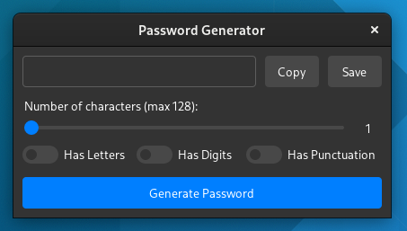

# Password Generator
This is a simple password generator written in Python for a college project. The bulk of the code is for the UI considering the simplicity of generating a random string (in Python at least). For the UI it uses Tkinter with my custom theme [Williams-Theme](https://github.com/unavailable-name/Williams-Theme "Williams-Theme"). The actual random number generation uses `random.SecureRandom()` which internally uses os provided randomness that is classed as cryptographically secure.

*DO NOT ACTUALLY USE THIS TO GENERATE YOUR PASSWORDS, THIS CODE IS NOT MEMORY SAFE AT ALL MAKING IT INSECURE*

# Program Screenshot:

# Options
- `Has Letters`: Generate a password that contains letters (a-z, A-Z)
- `Has Digits`: Generates a password that contains numbers (0-9)
- `Has Punctuation`: Generates a password that contains all ASCII punctuation
- `Number of characters`: Changes number of characters in the output (Who would have thought?)

Alongside the settings, there are 2 extra buttons `Copy` and `Save` - they both do what they say on the tin. Copy copies the result into your clipboard, Save prompts you to save a file somewhere on your computer.

`Generate Password` Generates a Password.
